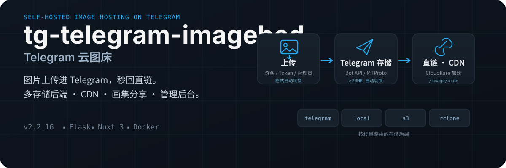
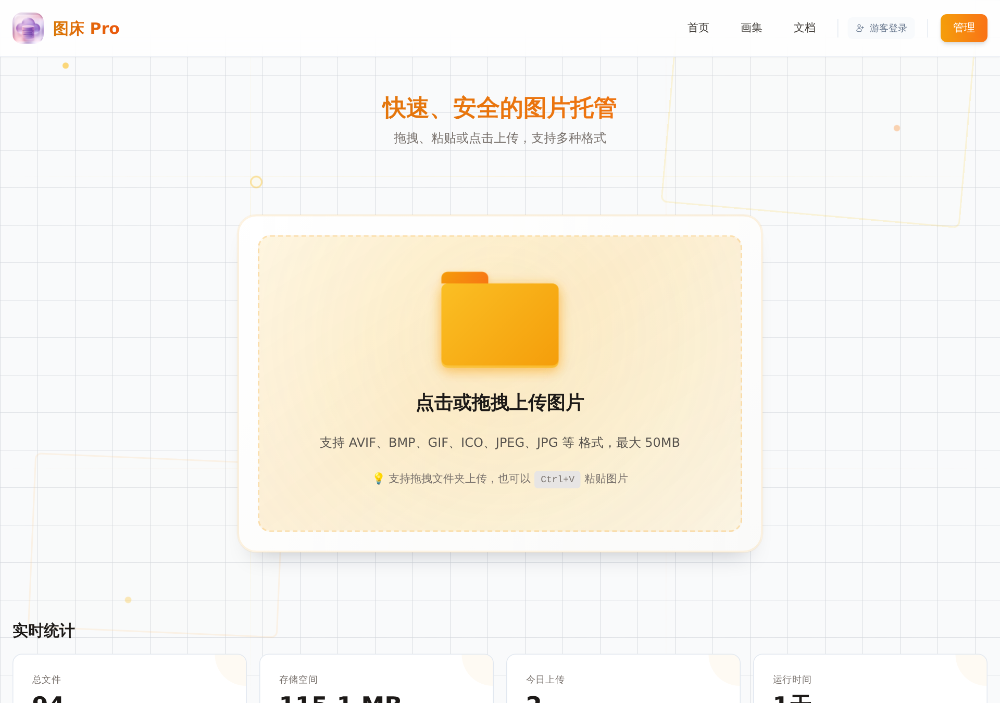

<p align="center">
  
</p>

<p align="center">
  
</p>

---

# tg-telegram-imagebed — Telegram 云图床

> 基于 Telegram 存储的单进程图床服务，后端 Flask，前端 Nuxt 3 静态构建。图片上传进 Telegram 频道，秒回直链。

支持管理后台、Token 上传、TG 认证、画集分享、Cloudflare CDN，以及按上传场景（`guest / token / group / admin`）路由的多存储后端。

**当前版本**: `v2.3.0`

## 为什么是它

- **Telegram 做主存储**：图片存进你的 Telegram 频道，Bot API / Kurigram (MTProto) 双通道，大文件自动切换
- **4 种内建存储驱动**：`telegram` / `local` / `s3` / `rclone`，按场景路由，切换后端不影响旧文件（每条记录绑定自己的 `storage_backend`）
- **完整的管理后台**：系统设置、存储配置、Token 管理、CDN 配置、画集管理、应用更新
- **多级上传入口**：游客上传、Token 上传、TG 登录绑定、群组/私聊上传，配限额与会话控制
- **Cloudflare CDN 集成**：缓存监控、重定向、延迟回源、图片专用域名限制
- **画集系统**：公开 / 私有 / Token / 密码访问模式，支持分享链接
- **图片格式自动转换**：可选转 WebP / JPEG / PNG，动图自动跳过
- **一键 Docker 部署**：`docker compose up -d --build` 即用

> [!IMPORTANT]
> - 业务配置走**管理后台和数据库**，不是传统 `.env` 驱动模式
> - 当前上传入口只接受**图片文件**，不是任意文件床
> - 超过约 `20 MB` 的大文件建议补齐 `API ID + API Hash`，后端会自动切到 Kurigram / MTProto
> - 反代出现 `413 Request Too Large`，先查你的 Nginx / Ingress / CDN 网关体积限制，不是应用炸了（见 [Issue #19](https://github.com/xiyan520/tg-telegram-imagebed/issues/19)）

## 快速开始

### 方式一：Docker Compose（推荐）

```bash
git clone https://github.com/lostiv/tg-telegram-imagebed.git
cd tg-telegram-imagebed
docker compose up -d --build
```

容器使用 UID/GID `10001`。首次使用前确保宿主机数据目录可写：

```bash
mkdir -p data && chown -R 10001:10001 data
```

> 从 v2.2.11 及更早版本升级：旧版本以 root 创建的数据目录需执行 `chown -R 10001:10001 data`，否则容器会因无法写日志而崩溃循环。

默认仅绑定 `127.0.0.1:18793`，启动后访问 `http://127.0.0.1:18793`。生产环境请通过 Nginx / Caddy / Ingress 反向代理发布，并配置 TLS；不要将未加防护的 Waitress 端口暴露公网。

首次进入初始化流程，按顺序配置最稳：

1. 创建管理员账号
2. 「存储配置」先把 Telegram 后端配起来（`Bot Token` + `chat_id`）
3. 要稳定处理 `20 MB+` 图片，补上 `API ID` + `API Hash`
4. 按需配置游客上传策略、Token、TG 认证、CDN、画集

### 方式二：本地手动运行

要求 Python `3.11` + Node.js `20`：

```bash
# 后端
pip install -r requirements.txt
python main.py

# 前端静态构建
cd frontend
npm install
npm run generate
```

注意：前端产物必须位于 `frontend/.output/public`，否则后端能起但首页提示「前端文件未找到」。

## 架构

```text
浏览器 / 客户端 ──上传──▶ Flask API ──▶ StorageRouter ──▶ telegram / local / s3 / rclone
        ▲                                              │
        └──────────── 直链 /image/<id> ◀── CDN ◀───────┘
```

- Flask 提供 API 与图片访问；Nuxt 前端静态构建后由 Flask 同端口托管
- Telegram Bot 在独立线程运行，不影响 Web 主流程
- `StorageRouter` 按配置为 `guest / token / group / admin` 场景选择后端，每条文件记录绑定具体后端——**切换活跃后端不会迁移旧文件，旧文件仍从原后端读取**

## 存储后端

| 驱动 | 标识 | 说明 | 注意 |
| --- | --- | --- | --- |
| Telegram | `telegram` | 默认主链路，Bot API / Kurigram 双通道 | `chat_id` 必填；大文件建议配 `api_id + api_hash` |
| Local | `local` | 保存到服务器本地目录 | 保证路径可写 |
| S3 Compatible | `s3` | AWS S3、MinIO、R2、OSS 等 | 默认依赖**不含** `boto3`，需额外安装 |
| rclone | `rclone` | 复用 rclone 支持的远程存储 | 运行环境需有 `rclone` 二进制和 remote 配置 |

**Telegram 大文件通道**：小文件走 Bot API；大于约 `20 MB` 且配置了 `API ID + API Hash` 时自动切 Kurigram / MTProto。只配 `Bot Token + chat_id` 也能用，但大文件上限与稳定性受限。

## API 与页面入口

| 路径 | 说明 |
| --- | --- |
| `/` | 前端首页 |
| `/docs` | 内置 API 文档页 |
| `/api/health` | 健康检查 |
| `/api/upload` | 匿名上传 |
| `/api/auth/upload` | Token 上传 |
| `/api/admin/upload` | 管理员上传 |
| `/image/<encrypted_id>` | 图片访问入口 |

更多接口以站内 `/docs` 页面为准。

## 配置要点

- **业务配置**：绝大多数配置存数据库 `admin_config` / `system_settings` 表，管理后台修改（Bot、存储路由、大小限制、游客策略、TG 认证、CDN、画集、SEO）
- **环境变量**：主要承担基础设施兜底——`ALLOWED_ORIGINS`（跨域白名单）、`HTTP_PROXY` / `HTTPS_PROXY`、`TRUSTED_PROXY`（可信反代 IP）、`BOT_TOKEN` 兜底
- **数据目录**：务必持久化 `./data`——`telegram_imagebed.db`（SQLite WAL）、`telegram_imagebed.log`、`.secret_key`、`uploads/`、`tmp/`

## Cloudflare CDN

不是填个域名就完事，三层逻辑：

1. 后台开启 CDN 并填对域名 / Token
2. Cloudflare 侧给 `/image/*` 做缓存规则
3. 开启 CDN 重定向后，项目按缓存状态 / 新上传延迟决定是否 302 到 CDN 域名

注意：新上传默认有短缓存/延迟回源窗口；图片域名和管理后台域名不是一个概念。

## 第三方生态

- **Typecho 插件 PicUp**：[仓库](https://github.com/lhl77/Typecho-Plugin-PicUp) · [文档](https://blog.lhl.one/artical/1026.html)——已支持 `tgimagebed` 驱动，覆盖匿名/Token 上传
- **GioPic / fileup.dev**：[官网](https://fileup.dev/)——浏览器端多节点上传客户端，可作为第三方适配入口（是否有现成适配取决于 GioPic 侧版本）

## 常见问题

- **没配 Bot，网站能先跑吗？** 能。Web 服务先起，Bot 等后续配置
- **调大文件大小还是 413？** 大概率是反向代理没放开体积限制，和应用内设置无关
- **配了 S3 说不可用？** 先查有没有装 `boto3`（默认依赖不带）
- **配了 rclone 报错？** 先确认环境里有 `rclone` 命令且 remote 可读
- **首页提示前端文件未找到？** 前端没构建，或产物不在 `frontend/.output/public`

## 开发说明

```text
.
├─ main.py              # 入口：Flask 线程 + Bot 线程
├─ tg_imagebed/
│  ├─ api/              # Flask 蓝图（upload/images/admin/auth）
│  ├─ bot/              # Telegram Bot（轮询/Webhook、批量媒体、热重启）
│  ├─ database/         # SQLite DAL（9 张表，WAL，带重试）
│  ├─ services/         # FileService / CDNService / TokenService
│  └─ storage/          # StorageRouter + 4 后端（策略模式）
├─ frontend/            # Nuxt 3 SPA
├─ data/
└─ tests/
```

- Python 依赖精确版本；更新后跑 `python -m pytest tests/ -q`
- 前端依赖 `package-lock.json` 锁定；`npm audit fix --force` 与跨主版本升级需单独评估
- Docker 基础镜像固定多架构 digest；更新后须重新构建

## 许可证

MIT
